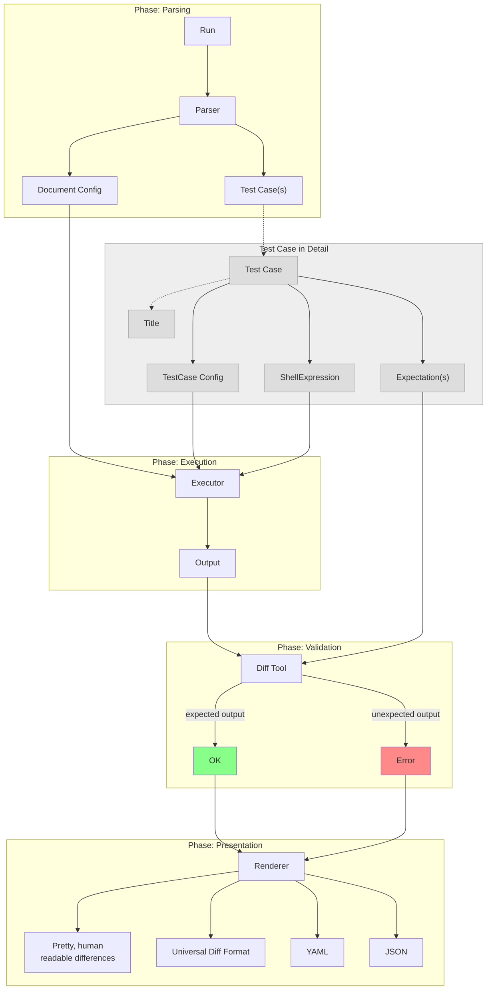

<!-- spaces needed -->

```mermaid
flowchart TB
  TestCase["Test Case"]
  TestCases["Test Case(s)"]
  Expectations["Expectation(s)"]
  DiffTool["Diff Tool"]
  DocumentConfiguration["Document Config"]
  TestCaseConfiguration["TestCase Config"]

  subgraph Parsing["Phase: Parsing"]
  Run ---> Parser
  Parser ---> TestCases
  Parser ---> DocumentConfiguration
  end

  subgraph Anatomy["Test Case in Detail"]
  TestCase ---> ShellExpression
  TestCase ---> TestCaseConfiguration
  TestCase ---> Expectations
  TestCase .-> Title
  end

  TestCases .-> TestCase

  subgraph Execution["Phase: Execution"]
  Executor ---> Output
  end

  DocumentConfiguration ---> Executor
  TestCaseConfiguration ---> Executor
  ShellExpression ---> Executor

  subgraph Validation["Phase: Validation"]
  DiffTool -- expected output ---> OK
  DiffTool -- unexpected output ---> Error
  end

  subgraph Presentation["Phase: Presentation"]
  OK ---> Renderer
  Error ---> Renderer
  Renderer ---> Diff["Pretty, human\nreadable differences"]
  Renderer ---> Patch["Universal Diff Format"]
  Renderer ---> YAML
  Renderer ---> JSON
  end

  Output ---> DiffTool
  Expectations ---> DiffTool

  style Anatomy fill:#eee,stroke:#aaa;
  style TestCase fill:#ddd,stroke:#aaa;
  style TestCaseConfiguration fill:#ddd,stroke:#aaa;
  style ShellExpression fill:#ddd,stroke:#aaa;
  style Expectations fill:#ddd,stroke:#aaa;
  style Title fill:#ddd,stroke:#aaa;
  style OK fill:#8f8;
  style Error fill:#f88;
```
