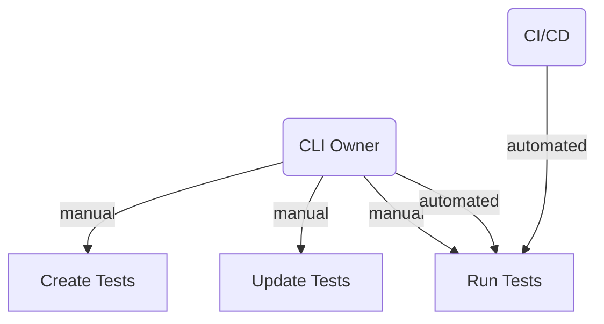

<!-- spaces needed -->

```mermaid
graph TD

    user(CLI Owner)
    create[Create Tests]
    update[Update Tests]
    run[Run Tests]
    cicd(CI/CD)

    user -- manual --> create
    user -- manual --> update
    user -- manual --> run
    user -- automated --> run
    cicd -- automated ---> run
```
